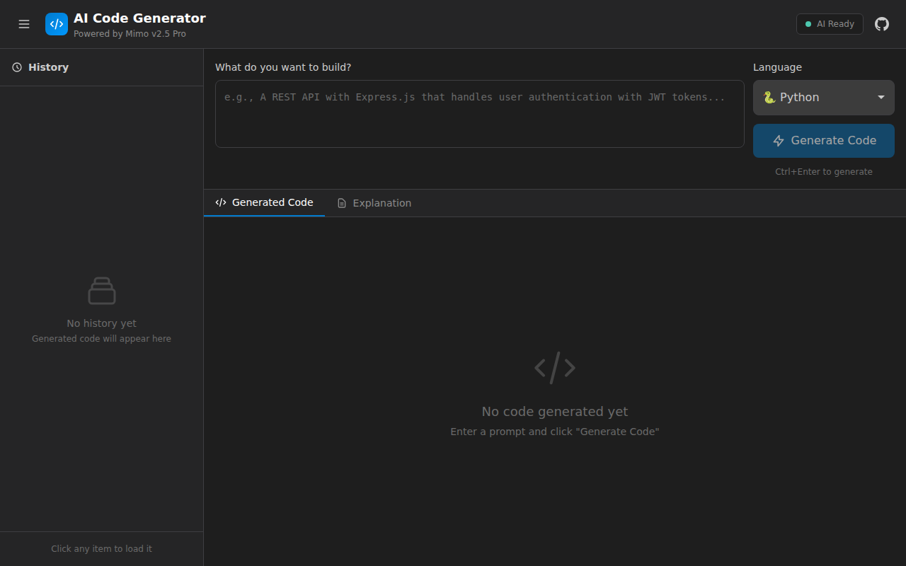

# AI Code Generator

A beautiful, VS Code-inspired AI Code Generator built with Next.js 14, TypeScript, and Tailwind CSS. Powered by the Mimo v2.5 Pro API.



## Features

- 🎨 **Beautiful Dark Theme** - VS Code-inspired UI with syntax highlighting
- 🚀 **Multi-Language Support** - Python, JavaScript, TypeScript, Rust, Go, Solidity
- 🤖 **AI-Powered** - Uses Mimo v2.5 Pro for intelligent code generation
- 📋 **Copy to Clipboard** - One-click code copying
- 📖 **Code Explanations** - Get detailed explanations of generated code
- 📱 **Mobile Responsive** - Works seamlessly on all devices
- 💾 **History Sidebar** - Keep track of all your generated snippets
- ⚡ **Fast & Modern** - Built with Next.js 14 App Router

## Tech Stack

- **Framework**: Next.js 14 (App Router)
- **Language**: TypeScript
- **Styling**: Tailwind CSS
- **Syntax Highlighting**: highlight.js
- **AI Model**: Mimo v2.5 Pro
- **Notifications**: react-hot-toast

## Getting Started

### Prerequisites

- Node.js 18+ 
- npm or yarn
- Mimo API Key

### Installation

1. Clone the repository:
```bash
git clone <your-repo-url>
cd ai-code-generator
```

2. Install dependencies:
```bash
npm install
```

3. Set up environment variables:
```bash
cp .env.example .env.local
```

Edit `.env.local` and add your Mimo API key:
```
MIMO_API_KEY=your_actual_api_key_here
```

4. Run the development server:
```bash
npm run dev
```

5. Open [http://localhost:3000](http://localhost:3000) in your browser.

## Deployment

### Vercel

1. Push your code to GitHub
2. Import your repository on [Vercel](https://vercel.com)
3. Add your `MIMO_API_KEY` environment variable
4. Deploy!

### Environment Variables

| Variable | Description |
|----------|-------------|
| `MIMO_API_KEY` | Your Mimo v2.5 Pro API key |

## Project Structure

```
src/
├── app/
│   ├── api/
│   │   └── generate/
│   │       └── route.ts      # API route for code generation
│   ├── globals.css           # Global styles & highlight.js theme
│   ├── layout.tsx            # Root layout
│   └── page.tsx              # Main page
├── components/
│   ├── CodeEditor.tsx        # Code input editor
│   ├── CodeOutput.tsx        # Generated code display
│   ├── HistorySidebar.tsx    # History sidebar
│   ├── LanguageSelector.tsx  # Language dropdown
│   └── Header.tsx            # App header
└── types/
    └── index.ts              # TypeScript interfaces
```

## API

The app uses the Mimo v2.5 Pro API with OpenAI-compatible format:

- **Endpoint**: `http://100.91.112.121:8317/v1/chat/completions`
- **Model**: `Mimo-V2.5-Pro`
- **Format**: OpenAI Chat Completions API

## License

MIT License - feel free to use this project for personal or commercial purposes.

## Contributing

Contributions are welcome! Please feel free to submit a Pull Request.
